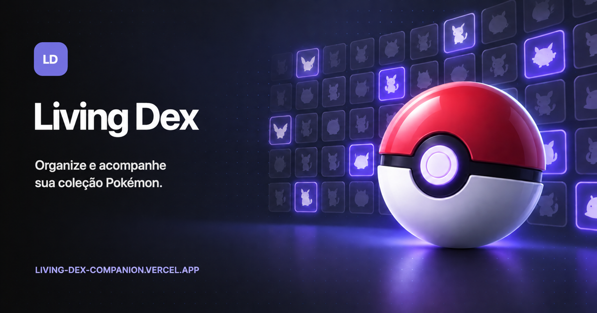
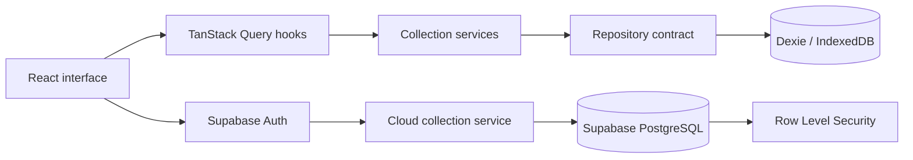

# Living Dex

**English** · [Português](README.pt-BR.md)

A local-first Pokémon collection companion for organizing a Living Dex by species, form, game, origin, Shiny status, Alpha status, and Original Trainer ownership.

**Production:** [living-dex-companion.vercel.app](https://living-dex-companion.vercel.app)



## What this project does

Living Dex presents a Pokémon collection as familiar box-based checklists instead of a spreadsheet. Collection data is stored in the browser first, so the core application works without an account. Users who choose to sign in can create a protected cloud copy through Supabase.

The application currently includes:

- A dashboard with collection totals and progress.
- The complete National Dex with 1,025 species.
- Normal, Shiny, Alpha, ownership, Original Trainer, generation, and type filters.
- Regional and special forms, including reusable form groups.
- Game-specific Dexes and sections for supported games and DLCs.
- Fast collection editing through details, double-click, and keyboard shortcuts.
- Batch completion and clearing actions with confirmation and Undo where applicable.
- Versioned JSON backups with validation, preview, merge, and replace modes.
- CSV export for external analysis or spreadsheets.
- Optional Google, Discord, and email Magic Link authentication.
- Automatic revisioned synchronization with explicit conflict resolution.
- English and Brazilian Portuguese interfaces.
- Responsive desktop/mobile layouts, dark/light themes, onboarding, and PWA support.

## Local-first and cloud behavior

The local and cloud layers have deliberately separate responsibilities.



- **Local collection:** IndexedDB is the primary data store used while navigating and editing the collection.
- **Optional account:** authentication is not required for local use.
- **Cloud synchronization:** after the user confirms the first upload, authenticated users automatically push local-only changes and receive cloud-only changes.
- **Conflict safety:** each device tracks its last synchronized revision. When both sides changed, neither is overwritten until the user chooses which copy to keep.
- **Status indicators:** the header reports disconnected, syncing, synchronized, conflict, and error states.
- **Offline behavior:** local edits continue in IndexedDB and are reconciled when connectivity returns, the tab regains focus, or the periodic check runs.

Cloud replacement is atomic and uses an expected revision, so a stale device cannot silently overwrite a newer remote collection.

## Technology stack

| Technology / platform | Role in the project |
| --- | --- |
| [React](https://react.dev/) | Component-based interface and application composition. |
| [TypeScript](https://www.typescriptlang.org/) | Static types for domain models, services, repositories, and UI contracts. |
| [Vite](https://vite.dev/) | Development server, production bundling, route code splitting, and environment variables. |
| [Tailwind CSS v4](https://tailwindcss.com/) | Design tokens and reusable visual rules through the Vite plugin, `@theme`, layers, and utilities. |
| [React Router](https://reactrouter.com/) | Client-side navigation between dashboard, Dex views, games, forms, and backup pages. |
| [TanStack Query](https://tanstack.com/query/latest) | Async state, collection queries, cache invalidation, and cloud summary requests. |
| [Zustand](https://zustand.docs.pmnd.rs/) | Small UI state such as filters, theme, language, and search selection. |
| [Dexie](https://dexie.org/) / IndexedDB | Typed local persistence and atomic browser database transactions. |
| [Supabase](https://supabase.com/) | Google/Discord/Magic Link authentication, PostgreSQL cloud storage, RPC functions, and Row Level Security. |
| [Lucide React](https://lucide.dev/) | Consistent interface icons; Google and Discord use recognizable brand marks. |
| [Vitest](https://vitest.dev/) | Unit and component test runner integrated with Vite. |
| [Testing Library](https://testing-library.com/) | User-oriented component interaction and accessibility queries. |
| [ESLint](https://eslint.org/) | Static code quality and React Hooks checks. |
| [GitHub Actions](https://github.com/features/actions) | Continuous integration for install, lint, types, tests, and build. |
| [Vercel](https://vercel.com/) | Preview/QA and production hosting, SPA rewrites, HTTPS, and security headers. |
| [PokéAPI](https://pokeapi.co/) | Development-time source for generated species, type, form, and Pokédex memberships. |

The runtime application uses versioned generated catalog files rather than requesting PokéAPI data whenever a page opens. Sprite images are loaded from documented public sources and cached after use where supported by the service worker.

## Requirements

- Node.js 22, matching CI.
- Corepack enabled.
- pnpm 10.15.0, declared in `package.json`.
- A modern browser with IndexedDB and Service Worker support.
- A Supabase project only if authentication/cloud features are needed.

## Run locally

```bash
git clone git@github.com:patrickt26/pokemon-living-dex.git
cd pokemon-living-dex
corepack enable
pnpm install
pnpm dev
```

Vite prints the local development URL, normally `http://localhost:5173`.

The application works locally without Supabase variables. In that mode, all core collection features continue to use IndexedDB.

## Environment variables

Copy the example file when cloud authentication is required:

```bash
cp .env.example .env.local
```

| Variable | Required | Description |
| --- | --- | --- |
| `VITE_SUPABASE_URL` | Cloud only | Public URL of the Supabase project. |
| `VITE_SUPABASE_PUBLISHABLE_KEY` | Cloud only | Publishable browser key protected by RLS policies. |

Never expose a Supabase secret key, legacy `service_role` key, database password, OAuth client secret, SMTP password, or CAPTCHA secret through a `VITE_` variable. Vite embeds these variables in the browser bundle.

For provider configuration, redirect URLs, migrations, and the production checklist, read [Cloud collection setup](docs/CLOUD_SETUP.md).

## Available commands

| Command | Purpose |
| --- | --- |
| `pnpm dev` | Start the Vite development server. |
| `pnpm build` | Type-check and generate the production bundle in `dist/`. |
| `pnpm lint` | Run ESLint across the project. |
| `pnpm typecheck` | Run the TypeScript project build without pretty output. |
| `pnpm test` | Run the complete Vitest suite once. |
| `pnpm test:watch` | Run tests in watch mode. |
| `pnpm data:generate:species` | Generate the versioned species catalog from a supplied PokéAPI export. |
| `pnpm data:generate:types` | Generate Pokémon type data from the expected CSV input. |
| `pnpm data:generate:games` | Generate game Pokédex memberships from PokéAPI resources. |

Run the full local validation before merging:

```bash
pnpm lint
pnpm typecheck
pnpm test
pnpm build
```

## Project structure

```text
pokemon-living-dex/
├── .github/workflows/       # Continuous integration
├── docs/                    # Architecture, cloud, assets, and release notes
├── public/                  # Manifest, service worker, icons, logos, social image
├── scripts/                 # Catalog generation scripts
├── src/
│   ├── app/                 # Dependency composition
│   ├── components/          # Reusable interface components
│   ├── data/                # Local catalog and generated Pokémon data
│   ├── domain/              # Models and pure collection rules
│   ├── hooks/               # React/TanStack Query integration
│   ├── lib/                 # External client configuration
│   ├── locales/             # English and Brazilian Portuguese strings
│   ├── pages/               # Route-level screens
│   ├── repositories/        # Persistence contracts and Dexie implementation
│   ├── services/            # Collection, backup, and cloud use cases
│   ├── store/               # Lightweight UI stores
│   └── test/                # Shared test setup
├── supabase/
│   ├── migrations/          # PostgreSQL schema, functions, constraints, and RLS
│   └── config.toml          # Safe, versioned Supabase project configuration
├── vercel.json              # Deploy rules, SPA rewrite, and security headers
└── vite.config.ts           # Vite, React, Tailwind, and Vitest configuration
```

## Architecture

The code separates domain rules from frameworks and persistence:

1. `domain` defines stable models and pure projections.
2. `data` provides a replaceable Pokémon catalog source.
3. `repositories` define persistence operations. Components do not import Dexie directly.
4. `services` implement use cases such as collection editing, backup validation, and revisioned cloud synchronization.
5. `hooks` connect services to React and TanStack Query.
6. `components` and `pages` render the user experience.

This boundary keeps local persistence independent from cloud reconciliation without rewriting domain rules or most UI components. See [Architecture](docs/ARCHITECTURE.md) for the detailed model.

## Data model

- `Species` represents National Dex identity, such as Pikachu.
- `PokemonForm` represents a stable visual or regional form linked to a species.
- `CollectionEntry` represents owned Pokémon aggregated by form, game, origin game, Shiny, Alpha, and Own OT attributes, with a quantity.
- `Game` describes a supported title and its Dex sections.
- `FormGroup` defines reusable special-form collections such as Unown or Rotom.

Progress values and `owned` flags are derived from collection entries. They are not duplicated in storage.

## Pokémon catalog

Catalog generation is separated from application runtime:

- Species and type exports are normalized into versioned TypeScript files.
- Game Dex memberships are generated from PokéAPI Pokédex resources.
- Sword/Shield combines Galar, Isle of Armor, and Crown Tundra, plus a Dynamax Adventures checklist.
- Scarlet/Violet combines Paldea, Kitakami, and Blueberry.
- Legends Z-A combines its supported Lumiose and expansion sections.
- BDSP and FireRed/LeafGreen expose their relevant regional and unlocked National Dex sections.

Generated files should be reviewed and committed. The production app should not depend on live PokéAPI availability for catalog structure.

## Backup and portability

JSON backups contain a format version, export timestamp, and portable collection entries. Internal database IDs and timestamps are excluded.

During import, the application:

1. Parses the JSON without modifying current data.
2. Verifies the supported backup version.
3. Validates species, forms, games, quantities, and boolean values against the local catalog.
4. Reports duplicate entries in a preview.
5. Applies either merge or replace mode through an atomic IndexedDB transaction.

CSV exports are intended for reading and analysis; JSON is the supported round-trip backup format.

## Authentication and cloud collection

Supabase Auth supports:

- Google OAuth.
- Discord OAuth.
- Passwordless email Magic Links.
- Automatic identity linking when providers return the same verified email.
- PKCE authentication flow in the browser client.

The cloud database stores collection entries under the authenticated user's UUID. PostgreSQL RLS policies scope every operation to `auth.uid()`. Sync RPCs validate authentication, payload type, maximum entry count, field lengths, numeric limits, and the expected cloud revision before committing atomically.

Names and email addresses remain in Supabase Auth. The application reads them from the current session to identify the account but does not copy them into collection tables or IndexedDB.

## Security

Security controls currently include:

- Row Level Security on every application table.
- No anonymous table access.
- Publishable key only in the frontend.
- PKCE, persistent session refresh, and exact callback URLs.
- Trusted avatar host allow-list for Google and Discord.
- Input constraints and authenticated PostgreSQL functions with a pinned `search_path`.
- HTTPS and database SSL enforcement.
- Content Security Policy restricted to required origins.
- HSTS, clickjacking protection, MIME-sniffing protection, a restrictive referrer policy, and permissions policy.
- Ignored `.env` and Supabase temporary files.
- Dependency auditing and a documented release security checklist.

No client application can guarantee security by itself. Supabase administrator MFA, provider secrets, SMTP credentials, CAPTCHA secrets, and network allow-lists must be managed outside the repository. Never commit real credentials.

## PWA and offline support

Production registers a small service worker and includes a Web App Manifest. The service worker uses a network-first strategy for navigation and caches the application shell plus eligible runtime assets.

After a successful first load, previously cached screens and assets can remain available offline. Authentication, cloud operations, and assets that have never been cached still require a network connection.

IndexedDB data is independent from the service-worker cache. Clearing site storage can remove both, so users should keep a JSON or cloud backup.

## Testing and continuous integration

Tests cover domain projections, generation filters, collection operations, Dexie migrations, backups, cloud services, OAuth options, account presentation, storage indicators, and user interactions.

GitHub Actions runs on pushes and pull requests using Node.js 22 and pnpm 10.15.0:

1. Frozen dependency installation.
2. ESLint.
3. TypeScript checks.
4. Vitest.
5. Production build.

Use [Release checklist](docs/RELEASE_CHECKLIST.md) for manual smoke and production security checks.

## Deployment workflow

Vercel is connected to two delivery stages:

- `main` is the QA branch and creates a Preview deployment.
- `prd` is the production branch and updates [living-dex-companion.vercel.app](https://living-dex-companion.vercel.app).
- Other branches do not deploy automatically.

The expected promotion flow is:

```text
feature/fix branch → main → validate QA preview → prd → production
```

Production uses the SPA fallback configured in `vercel.json`, so client-side routes such as `/national`, `/games/:gameId`, and `/backup` resolve to `index.html`.

## Current limitations and roadmap

- Cloud synchronization is snapshot-based and checks for remote changes every 30 seconds and when the tab regains focus; it does not require realtime subscriptions.
- Simultaneous local and remote edits require the user to choose which complete collection to keep; field-level merging is not attempted.
- Offline availability depends on the app and individual remote assets having been loaded previously.
- Custom SMTP, CAPTCHA, administrator MFA, and database network restrictions require external account or infrastructure configuration.
- Pokémon catalog updates are generated and reviewed manually rather than fetched at runtime.

## Additional documentation

- [Architecture](docs/ARCHITECTURE.md)
- [Cloud collection setup](docs/CLOUD_SETUP.md)
- [Release checklist](docs/RELEASE_CHECKLIST.md)
- [Assets and attribution](docs/ASSETS.md)
- [Portuguese README](README.pt-BR.md)

## Legal notice

Pokémon and related names, characters, game logos, and imagery are trademarks or copyrights of Nintendo, Creatures Inc., and GAME FREAK. This fan-made collection companion is not affiliated with or endorsed by those companies. See [Assets and attribution](docs/ASSETS.md) before any commercial use.
