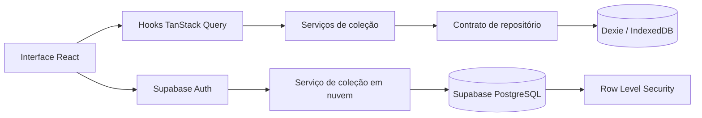

# Living Dex

[English](README.md) · **Português**

Um gerenciador local-first para organizar uma Living Dex Pokémon por espécie, forma, jogo, jogo de origem, status Shiny, status Alpha e Pokémon com Treinador Original próprio.

**Produção:** [living-dex-companion.vercel.app](https://living-dex-companion.vercel.app)


## O que este projeto faz

A Living Dex apresenta a coleção Pokémon como checklists inspirados nas boxes dos jogos, em vez de uma planilha. Os dados são armazenados primeiro no navegador, portanto as funções principais não exigem uma conta. Quem optar pelo login pode criar uma cópia protegida na nuvem usando Supabase.

A aplicação atualmente oferece:

- Dashboard com totais e progresso da coleção.
- National Dex completa com 1.025 espécies.
- Filtros Normal, Shiny, Alpha, posse, Treinador Original, geração e tipo.
- Formas regionais e especiais, incluindo grupos de formas reutilizáveis.
- Dexes específicas por jogo e seções para jogos e DLCs suportados.
- Edição rápida pelos detalhes, clique duplo e atalhos de teclado.
- Ações em lote para completar ou limpar, com confirmação e Undo quando aplicável.
- Backup JSON versionado com validação, prévia, mesclagem e substituição.
- Exportação CSV para análise externa ou planilhas.
- Autenticação opcional com Google, Discord e Magic Link por e-mail.
- Importação segura quando um dos lados está vazio e restauração da nuvem.
- Interfaces em inglês e português brasileiro.
- Layout responsivo, temas claro/escuro, onboarding e suporte PWA.

## Funcionamento local-first e nuvem

As camadas local e de nuvem possuem responsabilidades deliberadamente separadas.



- **Coleção local:** IndexedDB é o armazenamento principal usado durante a navegação e edição.
- **Conta opcional:** o login não é necessário para uso local.
- **Cópia na nuvem:** usuários autenticados podem importar a coleção local para uma coleção vazia na nuvem.
- **Restauração:** um snapshot da nuvem pode ser restaurado quando a coleção do dispositivo está vazia.
- **Indicadores:** o header compara resumos local e remoto; isso não significa sincronização contínua.
- **Limitação atual:** sincronização automática bidirecional e resolução de conflitos ainda não foram implementadas.

O envio à nuvem não apaga os dados locais. A importação é atômica e se recusa a sobrescrever uma coleção remota que não esteja vazia.

## Tecnologias e plataformas

| Tecnologia / plataforma | Função no projeto |
| --- | --- |
| [React](https://react.dev/) | Interface baseada em componentes e composição da aplicação. |
| [TypeScript](https://www.typescriptlang.org/) | Tipagem estática para domínio, serviços, repositórios e contratos de UI. |
| [Vite](https://vite.dev/) | Servidor de desenvolvimento, bundle de produção, divisão de rotas e variáveis de ambiente. |
| [Tailwind CSS v4](https://tailwindcss.com/) | Tokens e regras visuais reutilizáveis por meio do plugin Vite, `@theme`, layers e utilities. |
| [React Router](https://reactrouter.com/) | Navegação entre dashboard, Dexes, jogos, formas e backup. |
| [TanStack Query](https://tanstack.com/query/latest) | Estado assíncrono, consultas da coleção, invalidação de cache e resumos da nuvem. |
| [Zustand](https://zustand.docs.pmnd.rs/) | Estado leve da interface, como filtros, tema, idioma e seleção de busca. |
| [Dexie](https://dexie.org/) / IndexedDB | Persistência local tipada e transações atômicas no banco do navegador. |
| [Supabase](https://supabase.com/) | Login Google/Discord/Magic Link, PostgreSQL na nuvem, funções RPC e Row Level Security. |
| [Lucide React](https://lucide.dev/) | Ícones consistentes de interface; Google e Discord usam suas marcas reconhecíveis. |
| [Vitest](https://vitest.dev/) | Executor de testes unitários e de componentes integrado ao Vite. |
| [Testing Library](https://testing-library.com/) | Interações orientadas ao usuário e consultas de acessibilidade nos testes. |
| [ESLint](https://eslint.org/) | Qualidade estática e validação das regras de React Hooks. |
| [GitHub Actions](https://github.com/features/actions) | Integração contínua para instalação, lint, tipos, testes e build. |
| [Vercel](https://vercel.com/) | Hospedagem de QA e produção, rewrites da SPA, HTTPS e headers de segurança. |
| [PokéAPI](https://pokeapi.co/) | Fonte usada em desenvolvimento para gerar espécies, tipos, formas e associações de Pokédex. |

A aplicação em execução usa arquivos de catálogo gerados e versionados, em vez de consultar a PokéAPI toda vez que uma página é aberta. Sprites são carregados de fontes públicas documentadas e, quando suportado pelo service worker, armazenados em cache após o uso.

## Requisitos

- Node.js 22, igual ao CI.
- Corepack habilitado.
- pnpm 10.15.0, declarado em `package.json`.
- Navegador moderno com IndexedDB e Service Worker.
- Projeto Supabase apenas para autenticação e recursos de nuvem.

## Executar localmente

```bash
git clone git@github.com:patrickt26/pokemon-living-dex.git
cd pokemon-living-dex
corepack enable
pnpm install
pnpm dev
```

O Vite informa a URL local, normalmente `http://localhost:5173`.

A aplicação funciona sem variáveis do Supabase. Nesse modo, todos os recursos principais continuam usando IndexedDB.

## Variáveis de ambiente

Copie o arquivo de exemplo quando precisar do login e da nuvem:

```bash
cp .env.example .env.local
```

| Variável | Obrigatória | Descrição |
| --- | --- | --- |
| `VITE_SUPABASE_URL` | Somente nuvem | URL pública do projeto Supabase. |
| `VITE_SUPABASE_PUBLISHABLE_KEY` | Somente nuvem | Chave publicável do navegador, protegida pelas políticas RLS. |

Nunca exponha chave secreta do Supabase, chave legada `service_role`, senha do banco, segredo OAuth, senha SMTP ou segredo de CAPTCHA em uma variável `VITE_`. O Vite inclui essas variáveis no bundle do navegador.

Para provedores, redirects, migrations e checklist de produção, leia [Configuração da coleção em nuvem](docs/CLOUD_SETUP.md).

## Comandos disponíveis

| Comando | Finalidade |
| --- | --- |
| `pnpm dev` | Inicia o servidor de desenvolvimento Vite. |
| `pnpm build` | Verifica tipos e gera o bundle de produção em `dist/`. |
| `pnpm lint` | Executa ESLint em todo o projeto. |
| `pnpm typecheck` | Executa a verificação dos projetos TypeScript. |
| `pnpm test` | Executa uma vez toda a suíte Vitest. |
| `pnpm test:watch` | Executa testes em modo de observação. |
| `pnpm data:generate:species` | Gera o catálogo versionado de espécies a partir de uma exportação PokéAPI. |
| `pnpm data:generate:types` | Gera tipos Pokémon a partir do CSV esperado. |
| `pnpm data:generate:games` | Gera associações das Dexes de jogos usando recursos da PokéAPI. |

Execute a validação completa antes de um merge:

```bash
pnpm lint
pnpm typecheck
pnpm test
pnpm build
```

## Estrutura do projeto

```text
pokemon-living-dex/
├── .github/workflows/       # Integração contínua
├── docs/                    # Arquitetura, nuvem, assets e release
├── public/                  # Manifest, service worker, ícones, logos e imagem social
├── scripts/                 # Geração do catálogo
├── src/
│   ├── app/                 # Composição de dependências
│   ├── components/          # Componentes reutilizáveis
│   ├── data/                # Catálogo local e dados Pokémon gerados
│   ├── domain/              # Modelos e regras puras da coleção
│   ├── hooks/               # Integração React/TanStack Query
│   ├── lib/                 # Configuração de clientes externos
│   ├── locales/             # Textos em inglês e português brasileiro
│   ├── pages/               # Telas associadas às rotas
│   ├── repositories/        # Contratos de persistência e implementação Dexie
│   ├── services/            # Casos de uso da coleção, backup e nuvem
│   ├── store/               # Stores leves da interface
│   └── test/                # Configuração compartilhada de testes
├── supabase/
│   ├── migrations/          # Schema PostgreSQL, funções, constraints e RLS
│   └── config.toml          # Configuração segura e versionada do Supabase
├── vercel.json              # Deploy, rewrite da SPA e headers de segurança
└── vite.config.ts           # Configuração de Vite, React, Tailwind e Vitest
```

## Arquitetura

O código separa regras do domínio, frameworks e persistência:

1. `domain` define modelos estáveis e projeções puras.
2. `data` fornece uma origem substituível para o catálogo Pokémon.
3. `repositories` definem operações de persistência. Componentes não importam Dexie diretamente.
4. `services` implementam edição, validação de backup e transferências para a nuvem.
5. `hooks` conectam os serviços ao React e TanStack Query.
6. `components` e `pages` renderizam a experiência.

Essa divisão permite substituir a persistência local por um repositório sincronizado ou API sem reescrever as regras e a maior parte da interface. Consulte [Arquitetura](docs/ARCHITECTURE.md) para detalhes do modelo e pontos de extensão.

## Modelo de dados

- `Species` representa a identidade da National Dex, como Pikachu.
- `PokemonForm` representa uma aparência ou forma regional estável ligada a uma espécie.
- `CollectionEntry` representa Pokémon possuídos, agregados por forma, jogo, origem, Shiny, Alpha e Own OT, com quantidade.
- `Game` descreve um jogo e suas seções de Dex.
- `FormGroup` define coleções reutilizáveis de formas especiais, como Unown ou Rotom.

Valores de progresso e flags `owned` são derivados das entradas. Eles não são duplicados no armazenamento.

## Catálogo Pokémon

A geração do catálogo é separada da execução da aplicação:

- Exportações de espécies e tipos são normalizadas em arquivos TypeScript versionados.
- Associações das Game Dexes são geradas usando recursos Pokédex da PokéAPI.
- Sword/Shield combina Galar, Isle of Armor e Crown Tundra, além da checklist de Dynamax Adventures.
- Scarlet/Violet combina Paldea, Kitakami e Blueberry.
- Legends Z-A combina as seções suportadas de Lumiose e expansão.
- BDSP e FireRed/LeafGreen exibem suas seções regionais e de National Dex desbloqueável.

Arquivos gerados devem ser revisados e commitados. A estrutura do catálogo em produção não depende da disponibilidade da PokéAPI.

## Backup e portabilidade

Backups JSON contêm versão do formato, data de exportação e entradas portáteis. IDs e timestamps internos são removidos.

Na importação, a aplicação:

1. Interpreta o JSON sem modificar os dados atuais.
2. Verifica a versão suportada.
3. Valida espécies, formas, jogos, quantidades e booleanos contra o catálogo local.
4. Informa duplicatas em uma prévia.
5. Executa mesclagem ou substituição em uma transação IndexedDB atômica.

CSV é destinado à leitura e análise; JSON é o formato suportado para exportar e importar novamente.

## Autenticação e coleção em nuvem

Supabase Auth oferece:

- OAuth com Google.
- OAuth com Discord.
- Magic Link sem senha por e-mail.
- Vinculação automática quando provedores retornam o mesmo e-mail verificado.
- Fluxo PKCE no cliente web.

O banco remoto armazena entradas usando o UUID do usuário autenticado. Políticas PostgreSQL RLS limitam cada operação ao `auth.uid()`. A função RPC de importação valida autenticação, tipo do payload, quantidade máxima de registros, tamanho dos campos e limites numéricos antes do commit atômico.

Nome e e-mail permanecem no Supabase Auth. A aplicação os lê da sessão atual para identificar a conta, mas não os copia para as tabelas da coleção nem para IndexedDB.

## Segurança

Os controles atuais incluem:

- Row Level Security em todas as tabelas da aplicação.
- Nenhum acesso anônimo às tabelas.
- Somente chave publicável no frontend.
- PKCE, renovação de sessão e callbacks exatos.
- Lista de hosts confiáveis para avatares Google e Discord.
- Constraints de entrada e funções PostgreSQL autenticadas com `search_path` fixo.
- HTTPS e SSL obrigatório no banco.
- Content Security Policy limitada às origens necessárias.
- HSTS, proteção contra clickjacking e MIME sniffing, política restrita de referrer e Permissions Policy.
- Arquivos `.env` e temporários do Supabase ignorados pelo Git.
- Auditoria de dependências e checklist de segurança para releases.

Nenhuma aplicação cliente garante segurança sozinha. MFA dos administradores Supabase, segredos dos provedores, SMTP, CAPTCHA e allow-list de rede devem ser administrados fora do repositório. Nunca faça commit de credenciais reais.

## PWA e funcionamento offline

O build de produção registra um service worker pequeno e inclui Web App Manifest. O service worker usa network-first para navegação e mantém em cache o shell e assets de runtime elegíveis.

Após o primeiro carregamento bem-sucedido, telas e assets já armazenados podem continuar disponíveis offline. Login, nuvem e assets nunca carregados ainda precisam de internet.

IndexedDB é independente do cache do service worker. Limpar os dados do site pode remover ambos; por isso, mantenha backup JSON ou cópia na nuvem.

## Testes e integração contínua

Os testes cobrem projeções do domínio, filtros, operações de coleção, migrations Dexie, backups, serviços de nuvem, opções OAuth, apresentação da conta, indicadores de armazenamento e interações da interface.

GitHub Actions executa em pushes e pull requests com Node.js 22 e pnpm 10.15.0:

1. Instalação imutável das dependências.
2. ESLint.
3. Verificação TypeScript.
4. Vitest.
5. Build de produção.

Use o [Checklist de release](docs/RELEASE_CHECKLIST.md) para smoke tests e validações manuais de segurança.

## Fluxo de deploy

A Vercel está conectada a dois estágios:

- `main` é a branch de QA e gera um Preview deployment.
- `prd` é a branch de produção e atualiza [living-dex-companion.vercel.app](https://living-dex-companion.vercel.app).
- Outras branches não fazem deploy automático.

O fluxo esperado é:

```text
branch feature/fix → main → validar preview de QA → prd → produção
```

Produção utiliza o fallback de SPA do `vercel.json`, então rotas como `/national`, `/games/:gameId` e `/backup` são resolvidas por `index.html`.

## Limitações atuais e próximos passos

- A nuvem oferece importação e restauração seguras, não sincronização automática bidirecional.
- Resolução de conflitos entre dispositivos será definida junto com a sincronização.
- O funcionamento offline depende de a aplicação e os assets remotos terem sido carregados anteriormente.
- SMTP customizado, CAPTCHA, MFA administrativo e restrições de rede exigem contas ou infraestrutura externas.
- Atualizações do catálogo são geradas e revisadas manualmente, não buscadas durante a execução.

## Documentação adicional

- [Arquitetura](docs/ARCHITECTURE.md)
- [Configuração da coleção em nuvem](docs/CLOUD_SETUP.md)
- [Checklist de release](docs/RELEASE_CHECKLIST.md)
- [Assets e atribuição](docs/ASSETS.md)
- [README em inglês](README.md)

## Aviso legal

Pokémon e nomes, personagens, logos de jogos e imagens relacionados são marcas ou direitos autorais de Nintendo, Creatures Inc. e GAME FREAK. Este gerenciador feito por fãs não é afiliado nem endossado por essas empresas. Consulte [Assets e atribuição](docs/ASSETS.md) antes de qualquer uso comercial.
